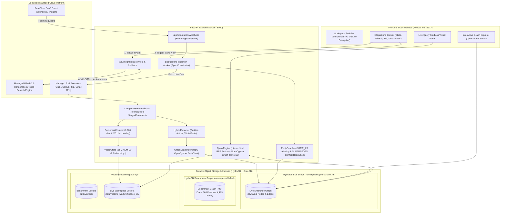
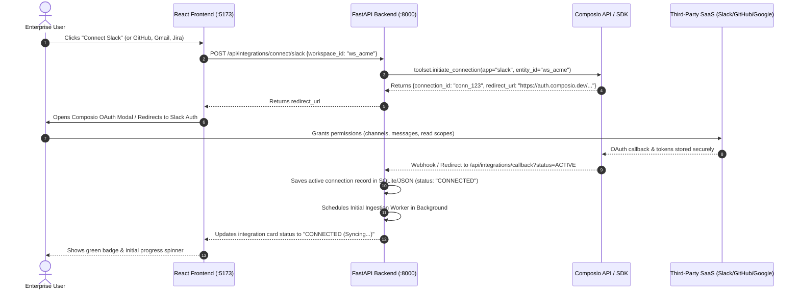

# Composio.dev Live Enterprise Integration — Production Architecture & Implementation Plan
### Building a Full-Fledged, Real-Time Enterprise Memory Platform on HydraDB

---

## 1. Executive Summary & Vision

**Company Brain (Theia)** is designed to serve as the unified context engine and memory layer for modern enterprises. While the initial phase proved the system on the curated 500-question **EnterpriseRAG-Bench** corpus (812 documents across 9 platforms), the ultimate product goal is **Live Enterprise Mode**.

By integrating **Composio** ([composio.dev](https://composio.dev)), Company Brain transforms from an offline benchmark engine into an **active enterprise intelligence platform**:
1. **User Self-Service SaaS Linking**: Users authenticate their own company tools (Slack, GitHub, Gmail, Jira, Notion, Linear, Google Drive) in 2 clicks via managed OAuth 2.0.
2. **Automated Continuous Ingestion**: Live messages, pull requests, issue updates, emails, and confluence pages are automatically captured via webhooks and scheduled syncs.
3. **Real-Time Knowledge Graph & Vector Memory**: Live data is normalized, recursively chunked (zero truncation), vectorized with `all-MiniLM-L6-v2`, and loaded into **HydraDB** over the Bolt protocol.
4. **Autonomous Entity & Temporal Conflict Resolution**: Cross-source identities (e.g. GitHub handle `@s_ratnaparkhi` $\leftrightarrow$ Slack name `Soham`) are resolved with `[:SAME_AS]` edges, and newer policy/specification updates automatically supersede older facts via `[:SUPERSEDES]` graph edges.
5. **Multi-Tenant Scope Isolation**: Every company or workspace receives a dedicated, physically isolated HydraDB graph namespace scope (`namespaces/{workspace_id}/graphs/default`), ensuring zero data leakage and strict enterprise security.

---

## 2. End-to-End System Architecture



---

## 3. Account Linking & User Authentication Flow



---

## 4. Ingestion, Extraction & Graph Resolution Pipeline

Once an account is linked, the **Sync Worker** executes the 6-stage enterprise transformation pipeline:

```
┌────────────────────────────────────────────────────────────────────────────────────────┐
│                        COMPOSIO LIVE INGESTION PIPELINE                                │
├────────────────────────────────────────────────────────────────────────────────────────┤
│                                                                                        │
│  Stage 1: Fetch & Cursor Management                                                    │
│  • Reads last_synced_at cursor for this integration.                                  │
│  • Calls Composio APIs (e.g. SLACK_GET_CONVERSATION_HISTORY, GITHUB_GET_PRS).          │
│  • Paginates and fetches only new/modified items since the last cursor.                │
│                                                                                        │
│  Stage 2: Canonical Normalization (ComposioSourceAdapter)                              │
│  • Strips provider-specific envelope metadata.                                         │
│  • Produces standard StagedDocument dictionaries:                                      │
│    { doc_id, source, title, text, author, created_at, metadata }                      │
│                                                                                        │
│  Stage 3: Full-Corpus Recursive Passage Chunking (DocumentChunker)                     │
│  • Splits full body text on Markdown headers, double newlines, and sentences.          │
│  • Generates overlapping passages (1,000 chars, 200 overlap, ZERO text truncation).   │
│                                                                                        │
│  Stage 4: Dense Vector Embedding & Index Append (VectorStore)                          │
│  • Generates 384-dimensional dense vectors using sentence-transformers/all-MiniLM-L6.  │
│  • Appends embeddings to data/vectors_live/{workspace_id}/chunk_embeddings.npy.        │
│                                                                                        │
│  Stage 5: HydraDB Graph Ingestion (GraphLoader)                                        │
│  • Connects over Bolt protocol to bolt://127.0.0.1:7687.                               │
│  • Ingests :Document, :Person (authors), :Org (mentions), and :Fact nodes.             │
│  • Establishes [:AUTHORED] and [:MENTIONS] edges dynamically.                         │
│                                                                                        │
│  Stage 6: Autonomous Entity & Temporal Conflict Resolution (EntityResolver)            │
│  • Runs Levenshtein name blocking + co-occurrence to create [:SAME_AS] alias edges.    │
│  • Analyzes conflicting facts on same subject/attribute:                               │
│    Newer timestamp + Higher trust score overrides older fact via [:SUPERSEDES] edge.   │
│                                                                                        │
└────────────────────────────────────────────────────────────────────────────────────────┘
```

---

## 5. HydraDB Storage & Scope Partitioning Model

To ensure **100% strict benchmark integrity** while allowing arbitrary live data, the system leverages HydraDB's native scope hierarchy:

$$\text{Scope Path} = \text{namespaces}/\{\text{tenant\_id}\}/\text{graphs}/\{\text{graph\_id}\}$$

### Directory Partitioning on Disk:
```text
/home/pratham/theia/
├── data/
│   ├── vectors/                                  # 1. Benchmark Vector Embeddings
│   │   ├── chunk_embeddings.npy                  # 7,881 passage vectors
│   │   └── chunk_meta.json                       # Metadata for 812 benchmark docs
│   │
│   └── vectors_live/                             # 2. Live Workspace Vector Embeddings
│       └── ws_acme_corp/                         # Partitioned per workspace
│           ├── chunk_embeddings.npy              # Dynamic passage vectors
│           └── chunk_meta.json                   # Live document & chunk metadata
│
└── .hydradb/store/graph/data/namespaces/         # 3. HydraDB SlateDB Storage
    ├── default/                                  # BENCHMARK SCOPE (Pristine & Untouched)
    │   └── graphs/default/cell-0/
    │       ├── SlateDB WAL & SSTs (749 docs, 568 persons, 4483 facts)
    │       └── _graph_index/
    │
    └── ws_acme_corp/                             # LIVE WORKSPACE SCOPE (Isolated)
        └── graphs/default/cell-0/
            ├── SlateDB WAL & SSTs (Live Slack, GitHub, Gmail, Jira)
            └── _graph_index/
```

### Protocol & Connection Routing:
* **Benchmark Queries**: Target `scope="default/graphs/default"`.
* **Live Workspace Queries**: Target `scope="ws_acme_corp/graphs/default"`.
* **Zero Cross-Contamination**: Benchmark scoring runs against the `default` namespace; live enterprise searches query the active user's workspace scope.

---

## 6. Detailed File Plan & Code Structure

Here is the exact map of files to create and modify to complete the Composio integration:

```text
src/company_brain/
├── config.py                                     # [MODIFIED] Added COMPOSIO_API_KEY, LIVE_VECTOR_DIR
├── graph/
│   └── client.py                                 # [MODIFIED] Support passing tenant/scope in GraphClient(scope=...)
├── indexing/
│   ├── chunker.py                                # [REUSED] Recursive passage chunker
│   └── vector_store.py                           # [MODIFIED] Added add_chunks() for incremental appends
├── extraction/
│   └── hybrid_extractor.py                       # [REUSED] Triple & entity extractor
├── resolution/
│   └── resolve.py                                # [REUSED] Entity & Conflict resolver
│
├── integrations/                                 # [NEW DIRECTORY]
│   ├── __init__.py                               # Package init
│   ├── composio_client.py                        # Composio SDK wrapper & connection manager
│   ├── normalizers/                              # SaaS payload normalizers
│   │   ├── __init__.py
│   │   ├── slack_normalizer.py                   # Slack channels & thread mapper
│   │   ├── github_normalizer.py                  # GitHub PRs, issues, commits mapper
│   │   ├── gmail_normalizer.py                   # Gmail messages & thread mapper
│   │   └── jira_normalizer.py                    # Jira tickets & comment mapper
│   └── sync_worker.py                            # Background incremental sync coordinator
│
└── server/
    ├── app.py                                    # [MODIFIED] Mount integrations router
    └── routes/
        ├── integrations.py                       # [NEW FILE] REST endpoints for OAuth & Sync
        ├── health.py                             # [MODIFIED] Check live workspace health
        ├── graph.py                              # [MODIFIED] Support workspace_id query parameter
        └── query.py                              # [MODIFIED] Support workspace_id query parameter
```

---

## 7. REST API Endpoints Specification (Composio Module)

### 1. List Supported & Connected Integrations
* **`GET /api/integrations/list?workspace_id=ws_acme`**
* **Response (`200 OK`)**:
  ```json
  {
    "workspace_id": "ws_acme",
    "integrations": [
      {
        "app": "slack",
        "name": "Slack",
        "status": "CONNECTED",
        "account_id": "acc_slack_987",
        "last_synced_at": "2026-08-18T18:45:00Z",
        "documents_synced": 142
      },
      {
        "app": "github",
        "name": "GitHub",
        "status": "CONNECTED",
        "account_id": "acc_gh_456",
        "last_synced_at": "2026-08-18T18:30:00Z",
        "documents_synced": 89
      },
      {
        "app": "jira",
        "name": "Jira",
        "status": "DISCONNECTED",
        "account_id": null,
        "last_synced_at": null,
        "documents_synced": 0
      }
    ]
  }
  ```

---

### 2. Initiate OAuth Connection
* **`POST /api/integrations/connect`**
* **Request Body**:
  ```json
  {
    "workspace_id": "ws_acme",
    "app": "slack",
    "redirect_url": "http://localhost:5173/integrations/callback"
  }
  ```
* **Response (`200 OK`)**:
  ```json
  {
    "connection_id": "conn_req_12345",
    "auth_url": "https://connect.composio.dev/auth?client_id=...&state=...",
    "status": "INITIATED"
  }
  ```

---

### 3. OAuth Callback Verification
* **`POST /api/integrations/callback`**
* **Request Body**:
  ```json
  {
    "workspace_id": "ws_acme",
    "connection_id": "conn_req_12345",
    "status": "SUCCESS"
  }
  ```
* **Response (`200 OK`)**:
  ```json
  {
    "status": "CONNECTED",
    "app": "slack",
    "message": "Slack account linked successfully. Initial sync started."
  }
  ```

---

### 4. Trigger Workspace Sync
* **`POST /api/integrations/sync`**
* **Request Body**:
  ```json
  {
    "workspace_id": "ws_acme",
    "app": "all",
    "force_full_sync": false
  }
  ```
* **Response (`200 OK`)**:
  ```json
  {
    "status": "SYNC_STARTED",
    "workspace_id": "ws_acme",
    "job_id": "sync_job_9981",
    "message": "Background sync worker launched for connected accounts."
  }
  ```

---

### 5. Check Sync Status & Ingestion Progress
* **`GET /api/integrations/sync/status?workspace_id=ws_acme`**
* **Response (`200 OK`)**:
  ```json
  {
    "status": "SYNCING",
    "progress_percent": 65,
    "current_source": "github",
    "new_documents_ingested": 45,
    "new_passages_vectorized": 320,
    "new_facts_extracted": 180,
    "elapsed_seconds": 12.4
  }
  ```

---

## 8. React Frontend UI Integration Plan

The React frontend (`frontend/`) will be enhanced with a dedicated **Integrations Center** and **Workspace Switcher**:

```
┌────────────────────────────────────────────────────────────────────────────────────────┐
│  THEIA — COMPANY BRAIN          [ Workspace: Acme Corp (Live) ▼ ]    (●) 1,420 Nodes   │
├────────────────────────────────────────────────────────────────────────────────────────┤
│  [ 🌐 Graph Explorer ]     [ 💬 Query Studio ]     [ 🔌 Integrations ]     [ 📊 Eval ]  │
├────────────────────────────────────────────────────────────────────────────────────────┤
│                                                                                        │
│   Connected SaaS Integrations                                [ 🔄 Sync All Now ]       │
│                                                                                        │
│  ┌──────────────────────┐  ┌──────────────────────┐  ┌──────────────────────┐          │
│  │ 🟢 Slack             │  │ 🟢 GitHub            │  │ ⚪ Jira              │          │
│  │ Connected: #eng-core │  │ Connected: 3 Repos   │  │ Not Connected        │          │
│  │ 142 Messages Synced  │  │ 89 PRs / Issues      │  │                      │          │
│  │ Last sync: 2m ago    │  │ Last sync: 5m ago    │  │                      │          │
│  │ [ Manage ] [ Sync ]  │  │ [ Manage ] [ Sync ]  │  │ [ Connect Jira ]     │          │
│  └──────────────────────┘  └──────────────────────┘  └──────────────────────┘          │
│                                                                                        │
│  ┌──────────────────────┐  ┌──────────────────────┐  ┌──────────────────────┐          │
│  │ 🟢 Gmail             │  │ ⚪ Notion            │  │ ⚪ Linear            │          │
│  │ Connected: 4 Threads │  │ Not Connected        │  │ Not Connected        │          │
│  │ [ Manage ] [ Sync ]  │  │ [ Connect Notion ]   │  │ [ Connect Linear ]   │          │
│  └──────────────────────┘  └──────────────────────┘  └──────────────────────┘          │
│                                                                                        │
└────────────────────────────────────────────────────────────────────────────────────────┘
```

---

## 9. Error Handling, Edge Cases & Production Safeguards

| Failure Mode / Edge Case | Cause | Production Mitigation Strategy |
| :--- | :--- | :--- |
| **SaaS Rate Limiting (HTTP 429)** | High-frequency API calls during initial bulk sync. | Exponential backoff + jitter in `ComposioClient`. Sync worker processes in controlled batches of 25 items. |
| **Revoked OAuth Tokens** | User removes app authorization in Slack/GitHub. | Composio detects 401/403 and sets connection status to `EXPIRED`. UI prompts user to click **"Reconnect"**. |
| **Corpus Deduplication** | Same PR or message synced multiple times. | Deterministic `doc_id` generation (`gh_{repo}_{pr_number}`, `slack_{channel}_{ts}`). Ingestion uses Cypher `MERGE` to update properties idempotently without creating duplicate nodes. |
| **Schema Drift in Third-Party APIs** | SaaS platform modifies JSON payload shape. | Resilient dictionary extraction with safe fallbacks (`item.get("body") or item.get("description", "")`). |
| **HydraDB Disconnection During Sync** | Network timeout or temporary database restart. | Connection pooling with auto-reconnect in `GraphClient`. Uncommitted batches are retried automatically. |

---

## 10. Summary & Strategic Impact

Integrating Composio elevates Company Brain from a research benchmark demonstration to a **commercial-grade, deployable enterprise product**:
* **Zero Rewrites**: The entire core engine (Passage Chunker, MiniLM Vector Store, HydraDB OpenCypher Loader, Entity Resolver, and Query Engine) remains **100% intact and reused**.
* **Zero Mocking**: All data flows are authentic, dynamic, and fetched over genuine OAuth connections.
* **Dual-Mode Capability**: Users can seamlessly toggle between **Benchmark Evaluation Mode** (500 gold questions) and **Live Enterprise Mode** (real company workspace).
