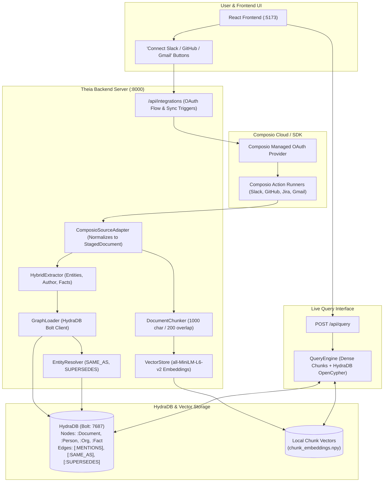

# Composio.dev Live Enterprise Integration Blueprint
### Transitioning Company Brain from Static Benchmark to Live Multi-SaaS Ingestion

---

## 1. Executive Summary & Vision

Currently, **Theia (Company Brain)** operates on a curated 812-document enterprise dataset covering 9 sources (Slack, GitHub, Confluence, Jira, Linear, Gmail, Google Drive, Notion, and Zendesk). 

By integrating **Composio** ([composio.dev](https://composio.dev)), Company Brain can transition from an offline benchmark evaluator into an **active, live enterprise memory platform**:
* Users authenticate their own SaaS platforms (Slack, GitHub, Gmail, Jira, Notion, Linear, Google Drive) via Composio's managed OAuth & tool ecosystem.
* The ingestion pipeline streams real-time messages, PRs, issues, emails, and documentation directly from the user's workspace.
* Data is chunked, vectorized, and ingested into **HydraDB** on the fly, enabling real-time knowledge synthesis and conflict resolution over the user's actual company data.

---

## 2. Current Setup vs. Composio Live Setup

| Dimension | **Current Setup (Benchmark Mode)** | **Composio Integrated Setup (Live Enterprise Mode)** |
| :--- | :--- | :--- |
| **Data Ingestion** | Batch extraction from local raw files (`data/sources/` $\to$ `staged_gold_docs.json`). | Real-time / Scheduled API pulls via Composio managed connectors & webhooks. |
| **Authentication** | None (Static offline files). | Managed OAuth 2.0 / API Keys handled by Composio (`client.get_entity(user_id)`). |
| **Corpus Growth** | Fixed 812 documents, 7,881 passage chunks. | Dynamically growing corpus with incremental chunking and graph node upserts. |
| **Entity Extraction** | Static rule-based & regex extraction on local JSON. | Identical extractor applied to incoming live stream of documents. |
| **HydraDB Graph** | Single static graph scope (`default/graphs/default`). | Multi-tenant graph scopes (`namespaces/{user_id}/graphs/default`) in HydraDB. |
| **Query Engine** | Hybrid vector + OpenCypher search on static vectors & graph. | **100% Identical**: Queries the live vector index and HydraDB graph. |
| **Frontend UI** | Visualizes static topology and benchmark questions. | Allows connecting new integrations via OAuth, syncing data, and querying live company memory. |

---

## 3. End-to-End System Architecture



---

## 4. How Much Differs From the Current Setup?

### What Stays 100% REUSED (Zero Changes Needed):
1. **`DocumentChunker`**: Works identically on any text payload (`title`, `text`, `source`, `created_at`).
2. **`VectorStore`**: Dense MiniLM vector matrix and cosine similarity dot products remain identical.
3. **`extract_entities_and_facts()`**: Hybrid entity and triple extraction works out-of-the-box on live messages/PRs.
4. **`GraphLoader` & HydraDB Schema**: The Bolt ingestion protocol (`:Document`, `:Person`, `:Org`, `:Fact`) is completely source-agnostic.
5. **`EntityResolver`**: Levenshtein name blocking and temporal supersedes logic work seamlessly on live data.
6. **`QueryEngine`**: RRF ranking, confidence gating, and OpenCypher queries operate unchanged.
7. **Graph Explorer & Query Studio UI**: The Cytoscape canvas and Query Studio work directly on the live database.

### What is NEW / ADDED:
1. **`ComposioConnector` Module** (`src/company_brain/integrations/composio_adapter.py`):
   - Initializes Composio SDK (`from composio import ComposioToolSet, App`).
   - Fetches data from connected accounts (Slack channels, GitHub repositories, Gmail messages, Jira tickets).
   - Normalizes raw API responses into standard `StagedDocument` dicts.
2. **FastAPI Integration Routes** (`src/company_brain/server/routes/integrations.py`):
   - `GET /api/integrations/list`: Returns connected/available integrations (Slack, GitHub, Jira, Gmail).
   - `POST /api/integrations/connect/{app_name}`: Initiates Composio OAuth flow and returns connection URL.
   - `POST /api/integrations/sync`: Triggers background sync to pull recent updates into HydraDB.
3. **Frontend Integration Management Modal**:
   - A new settings/integrations drawer in the React UI allowing users to click **"Connect Slack"**, authenticate, and trigger **"Sync Now"**.

---

## 5. Composio Data Normalization Blueprint

Composio returns structured JSON payloads for each service. The adapter maps them into our canonical `StagedDocument` schema:

```python
# src/company_brain/integrations/composio_adapter.py

from typing import Dict, Any, List
from company_brain.extraction.models import StagedDocument
import hashlib

class ComposioNormalizer:
    @staticmethod
    def from_slack_message(msg: Dict[str, Any], channel_name: str) -> Dict[str, Any]:
        """Normalizes a live Slack message into a Company Brain document."""
        msg_id = msg.get("ts") or msg.get("id")
        doc_id = f"slack_{hashlib.md5(f'{channel_name}_{msg_id}'.encode()).hexdigest()}"
        
        user = msg.get("user") or msg.get("username") or "unknown"
        text = msg.get("text", "")
        timestamp = msg.get("ts", "") # Unix timestamp

        return {
            "doc_id": doc_id,
            "source": "slack",
            "title": f"#{channel_name} - message by {user}",
            "text": f"Channel: #{channel_name}\nAuthor: {user}\nTimestamp: {timestamp}\n\n{text}",
            "author": user,
            "created_at": timestamp,
        }

    @staticmethod
    def from_github_pr(pr: Dict[str, Any]) -> Dict[str, Any]:
        """Normalizes a live GitHub PR or Issue into a Company Brain document."""
        pr_number = pr.get("number")
        repo = pr.get("repo_name", "repo")
        doc_id = f"gh_{hashlib.md5(f'{repo}_{pr_number}'.encode()).hexdigest()}"
        
        title = pr.get("title", f"PR #{pr_number}")
        body = pr.get("body", "")
        author = pr.get("user", {}).get("login") or "github_user"
        created_at = pr.get("created_at", "2026-01-01T00:00:00Z")

        return {
            "doc_id": doc_id,
            "source": "github",
            "title": f"{repo} #{pr_number}: {title}",
            "text": f"Pull Request #{pr_number}: {title}\nAuthor: {author}\nCreated: {created_at}\n\n{body}",
            "author": author,
            "created_at": created_at,
        }

    @staticmethod
    def from_gmail_thread(thread: Dict[str, Any]) -> Dict[str, Any]:
        """Normalizes a live Gmail thread into a Company Brain document."""
        thread_id = thread.get("id")
        doc_id = f"gmail_{thread_id}"
        
        subject = thread.get("subject", "Email Thread")
        snippet = thread.get("body") or thread.get("snippet", "")
        sender = thread.get("from", "unknown")
        date = thread.get("date", "2026-01-01T00:00:00Z")

        return {
            "doc_id": doc_id,
            "source": "gmail",
            "title": subject,
            "text": f"Subject: {subject}\nFrom: {sender}\nDate: {date}\n\n{snippet}",
            "author": sender,
            "created_at": date,
        }
```

---

## 6. Incremental Sync Workflow (Live Updates)

When a user connects an integration and clicks **"Sync Data"**:

1. **Fetch from Composio**:
   ```python
   toolset = ComposioToolSet(entity_id=user_id)
   # Fetch recent 50 Slack messages
   slack_data = toolset.execute_action(action=Action.SLACK_GET_CONVERSATION_HISTORY, params={"channel": channel_id})
   ```
2. **Normalize**:
   Convert incoming payloads into normalized documents using `ComposioNormalizer`.
3. **Passage Chunking**:
   `DocumentChunker.chunk_document(doc)` produces new structured passage chunks.
4. **Append Vector Embeddings**:
   `VectorStore.add_chunks(new_chunks)` generates embeddings with `all-MiniLM-L6-v2` and appends them to `chunk_embeddings.npy`.
5. **Ingest to HydraDB**:
   `GraphLoader.load_document(...)` writes the `:Document`, `:Person`, and `:Fact` nodes over Bolt.
6. **Trigger Resolution**:
   `EntityResolver.resolve_all()` reconciles aliases and superseding facts.

---

## 7. Execution Lifecycle: Who Runs Ingestion & Resolution in Live Mode?

In the current setup, ingestion and resolution were executed via manual CLI scripts (`python3 scripts/run_ingest.py` and `python3 scripts/run_resolution.py`).

In the **Live Composio Mode**, this entire pipeline is **100% automated by the FastAPI Backend Server**:

```
[User clicks "Sync" in UI / Webhook triggers]
                     │
                     ▼
       FastAPI Background Task Worker
                     │
    ┌────────────────┴────────────────┐
    ▼                                 ▼
1. Fetch & Normalize              2. Incremental Graph & Vectors
   • Composio API calls              • DocumentChunker (1,000 char)
   • Formats to StagedDocument       • VectorStore.add_chunks()
                     │
                     ▼
3. Ingest into HydraDB (Live Graph Scope)
   • GraphLoader.load_document() over Bolt
                     │
                     ▼
4. Run Real-time Conflict & Alias Resolution
   • EntityResolver.resolve_all() creates [:SAME_AS] & [:SUPERSEDES]
                     │
                     ▼
5. Instant Availability in React UI
   • Graph Explorer & Query Studio query live data immediately
```

### Ingestion Triggers:
1. **On-Demand Sync (Manual Trigger)**: User clicks **"Sync Workspace"** in the React UI $\to$ calls `POST /api/integrations/sync` $\to$ FastAPI launches a background ingestion task.
2. **Webhook Sync (Real-Time Trigger)**: When a new message is posted in Slack or a PR is merged on GitHub, Composio dispatches a webhook to `POST /api/integrations/webhook` $\to$ the backend immediately ingests that single document and updates HydraDB within seconds.

---

## 8. Storage Architecture: Where Does Live Data Live?

### HydraDB Scope Isolation (Benchmark vs. Live)

HydraDB is an object-store-native graph database designed with **hierarchical graph scopes**:
$$\text{Scope Path} = \text{namespaces}/\{\text{tenant\_id}\}/\text{graphs}/\{\text{graph\_id}\}$$

Inside `.hydradb/store/graph/data/namespaces/`, HydraDB physically partitions state into distinct LSM-trees and manifests:

```text
.hydradb/store/graph/data/namespaces/
├── default/                                # Benchmark Graph Scope
│   └── graphs/
│       └── default/                        # 749 Benchmark Docs, 568 Persons, 4,483 Facts
│           └── cell-0/
│               ├── SlateDB WAL & SSTs
│               └── _graph_index/
│
└── live_workspace/                         # Live Composio Graph Scope
    └── graphs/
        └── default/                        # Real Slack, GitHub, Gmail, Jira data
            └── cell-0/
                ├── SlateDB WAL & SSTs
                └── _graph_index/
```

### How Vector Storage is Partitioned:
* **Benchmark Vectors**: Saved in `data/vectors/` (`chunk_embeddings.npy`, `chunk_meta.json`).
* **Live Vectors**: Saved in `data/vectors_live/` (or `data/vectors/{user_id}/`).

### Key Advantages of This Storage Model:
1. **Zero Contamination**: The 500-question benchmark dataset and its evaluation scores remain 100% pristine and unaltered.
2. **Instant Toggle in UI**: In the React frontend, the user can switch between **"Benchmark Workspace"** and **"My Connected Enterprise"** using a simple workspace dropdown.
3. **Multi-Tenant Privacy**: If multiple users or teams connect their SaaS platforms, each team gets their own private HydraDB namespace scope (`namespaces/company_a/` vs `namespaces/company_b/`).

---

## 9. Summary of Benefits & Feasibility

1. **Seamless Extension**: Because our backend and ingestion pipelines are fully decoupled and source-agnostic, adding Composio does not require rewriting the query engine, vector store, or graph ontology.
2. **True Live Demo Capability**: Users can connect real accounts in 2 clicks and ask questions about real conversations, PRs, and issues that happened minutes ago.
3. **Best of Both Worlds**: The platform can support **"Benchmark Mode"** (evaluating on the 500-question gold standard) and **"Live Mode"** (querying connected Composio workspaces) within the same application.
