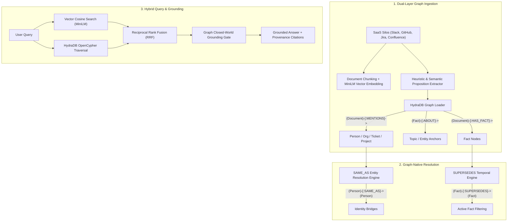

# Theia: Enterprise Company Brain on HydraDB

[](https://github.com/hydradb/hydradb)
[](https://github.com/slatedb/slatedb)
[](https://huggingface.co/sentence-transformers/all-MiniLM-L6-v2)
[](https://neo4j.com/docs/bolt/current/)
[]()

> **Theia** is a high-precision, graph-native enterprise intelligence platform powered by **HydraDB**. It addresses the fundamental failure modes of traditional vector RAG—alias fragmentation, temporal contradictions, multi-hop blindness, and ungrounded hallucinations—by unifying dense semantic vector search with graph-native identity resolution, reified topic ontology, and temporal conflict supersession.

---

## 📑 Table of Contents
1. [Introduction](#1-introduction)
2. [Problem Statement](#2-problem-statement)
3. [The Solution: Graph-Native Enterprise Intelligence](#3-the-solution-graph-native-enterprise-intelligence)
4. [Why Traditional Vector RAG Fails in the Enterprise](#4-why-traditional-vector-rag-fails-in-the-enterprise)
5. [Dataset Strategy: Two Corpora, Reported Separately](#5-dataset-strategy-two-corpora-reported-separately)
6. [How HydraDB is Utilized (Complete Technical Detail)](#6-how-hydradb-is-utilized-complete-technical-detail)
7. [System Architecture](#7-system-architecture)
8. [Implementation Phases & Methodology](#8-implementation-phases--methodology)
   - [Phase 1: Graph-Native Ingestion & Fact/Topic Reification (`:ABOUT`)](#phase-1-graph-native-ingestion--facttopic-reification-about)
   - [Phase 2: Graph Normalization & Entity Resolution (`:SAME_AS`)](#phase-2-graph-normalization--entity-resolution-same_as)
   - [Phase 3: Temporal Conflict & Authority Supersession (`:SUPERSEDES`)](#phase-3-temporal-conflict--authority-supersession-supersedes)
   - [Phase 4: Hybrid Graph + Vector Query Engine & RRF](#phase-4-hybrid-graph--vector-query-engine--rrf)
9. [Live SaaS Integrations & Multi-Tenancy](#9-live-saas-integrations--multi-tenancy)
10. [Benchmark Evaluation Results](#10-benchmark-evaluation-results)
11. [Quickstart & Reproducibility Guide](#11-quickstart--reproducibility-guide)
12. [Engineering Log: Failures Hit and How They Were Diagnosed](#12-engineering-log-failures-hit-and-how-they-were-diagnosed)
13. [Remaining Limitations](#13-remaining-limitations)

---

## 1. Introduction

Modern enterprises run on a fragmented sprawl of asynchronous SaaS tools: **Slack discussions, Linear/Jira tickets, GitHub pull requests and commits, Confluence architecture specifications, Google Drive documents, and Gmail communications**. 

When engineers, managers, or executives need authoritative answers, standard AI search tools struggle because enterprise truth is **relational, temporal, and entity-anchored**.

**Theia** transforms enterprise knowledge from disconnected flat text dumps into an interconnected **HydraDB Knowledge Graph**, pairing local dense semantic vector search with real-time graph traversals.

The shipped graph, measured live via `/api/health`:

| Element | Count |
| :--- | ---: |
| Document hubs | **25,812** |
| Atomic facts (`:HAS_FACT`) | **10,357** |
| Metric / config keys | 22,891 |
| Person entities | 10,844 |
| Reified topic nodes (`:ABOUT`) | 7,197 |
| Tickets | 10,291 |
| Projects | 1,965 |
| Organisations | 221 |
| Identity bridges (`:SAME_AS`) | 78 |
| Supersession edges (`:SUPERSEDES`) | 2,412 |
| Dense passage vectors | 184,802 |

**25,000 of those 25,812 documents are distractors** — see §5 for why that matters and §10 for what
it costs.

> **On the fact count.** An earlier build of this graph reported **209,343 facts**. That number was
> not meaningful: **96% of it (19,193 of a 20,000-node sample) was tautological** — the heuristic
> extractor minted `(X, "metric_name", X)` for every dotted token, so `catalog.md`, `1.14.1` and
> `streamly.ai` all counted as "facts" while asserting nothing (§12.5). Those are now modelled as
> `:Metric` entities a document *mentions*, and the 812 benchmark documents were re-extracted with an
> LLM. The result is a smaller number that is actually true: **10,357 facts across 753 distinct
> attribute types** (`max_file_size`, `owner`, `status`, `region`, `start_date`…) rather than one
> meaningless `limit_or_target`. Fact coverage of the benchmark corpus went from **15% to 93% of
> documents**.

`SAME_AS` is likewise smaller and better: an earlier permissive threshold produced 637 edges, ~21% of
which merged distinct colleagues (`Nadia Rahman`/`Priya Raman`, `R Mendes`/`Lucas Mendes`). The 78
published edges survive a same-surname check and an ambiguity rule — see §13.4.

---

## 2. Problem Statement

Enterprise search faces four critical challenges that break standard AI architectures:

1. **Entity & Identity Disconnection**: A single person appears under multiple representations (Slack `@soham`, Git commit author `S. Ratnaparkhi`, Linear assignee `Soham`, legal name `Soham Ratnaparkhi`). Vector search treats these as unrelated keywords.
2. **Temporal Contradictions**: Policies, SLAs, and technical specifications change continuously. Earlier documents frequently contain higher keyword density or vector similarity to a query than a brief two-sentence slack message announcing the updated policy, leading LLMs to retrieve and cite obsolete numbers.
3. **Multi-Hop Blindness**: Answering complex enterprise inquiries requires traversing relationships across distinct tools (e.g., *Customer Org mentioned in Gmail $\rightarrow$ Tracked in Jira Ticket $\rightarrow$ Resolved in GitHub PR*). Vector RAG cannot follow relational links across disparate silos.
4. **Ungrounded Hallucinations on Absent Data**: When a specific attribute or metric does not exist in company records, vector similarity still surfaces topical documents, causing models to hallucinate plausible facts instead of recognizing absence.

---

## 3. The Solution: Graph-Native Enterprise Intelligence

Theia unifies **HydraDB**'s openCypher graph kernel with dense vector retrieval to create a single coherent enterprise brain:



---

## 4. Why Traditional Vector RAG Fails in the Enterprise

| Enterprise Challenge | Traditional Vector RAG | Theia (HydraDB + Graph-Native Brain) |
|---|---|---|
| **Identity & Alias Fragmentation** | Treats `@soham`, `S. Ratnaparkhi`, and `Soham` as disconnected entities. | **`[:SAME_AS]` graph edges** bridge handles, emails, and full names with confidence weights. |
| **Contradictory Assertions** | Retrieves stale documents with high cosine similarity, presenting obsolete policies as true. | **`[:SUPERSEDES]` graph edges** deprecate outdated assertions; superseded facts are pruned at query time so answers cite only active ones. *Ranking is by source authority, not recency — see §13.3.* |
| **Multi-Hop Traversal** | Cannot bridge connections across disparate systems. | **HydraDB Graph Traversal** follows `[:MENTIONS]` and `[:ABOUT]` paths across documents and entities. |
| **Hallucination on Missing Data** | Generates fabricated answers when a specific fact is absent. | **HydraDB Closed-World Grounding Gate** verifies fact presence in the ontology before synthesis. |
| **Operational Privacy** | Relies on third-party cloud vector stores and LLM embedding APIs. | **100% Local Inference**: Runs entirely on local HydraDB and open-weights embeddings (`all-MiniLM-L6-v2`). |

---

## 5. Dataset Strategy: Two Corpora, Reported Separately

The full EnterpriseRAG-Bench release is **511,962 documents** across 9 silos — real enterprise noise:
CI/CD logs, bot notifications, empty threads, near-duplicates and boilerplate. Theia is evaluated
against **two corpora**, and we report both, because they measure different things.

### 5.1 Gold corpus — 812 documents (`data/staged_gold_docs.json`)

Every document named in the benchmark's `expected_doc_ids`, staged by prefix matching in `< 1.0s`.

**This corpus contains zero distractors: 100% of its documents are the answer to some question.**
It is a *ceiling* measurement — how well the ontology and query engine perform when retrieval cannot
be wrong about which haystack to search. It is deliberately not a difficulty claim, and it is not
comparable to the published leaderboard.

### 5.2 Noisy corpus — 25,812 documents (`scripts/stage_noisy_corpus.py`)

All 812 gold documents **plus 25,000 randomly sampled non-gold documents** — **96.9% distractors**,
a 31× larger haystack. Sampling uses a fixed seed (1337), so the corpus is reproducible without
committing the 136 MB artifact:

```bash
bash scripts/download_dataset.sh --all
python scripts/stage_noisy_corpus.py --distractors 25000 --seed 1337
```

This is the honest measurement, and the one to judge retrieval by. See §10 for both result sets.

### 5.3 Why not all 511,962 documents

Measured ingest throughput is ~0.34 s/document (extraction + Bolt writes), so the full corpus is roughly
48 hours of single-writer ingest — HydraDB 0.1.0 permits only one writer at a time. 25,812 documents is
what fits the build window while still containing enough noise for the result to mean something. This is
a resource limit, not a claim that the approach stops at 25k.

### 5.4 The LLM fact cache is committed (`data/llm_facts_gold.json`, 852 KB)

The headline numbers depend on facts extracted by Gemini, and regenerating them needs a
`GEMINI_API_KEY` and roughly an hour against the free tier. So the extraction output is **committed**
rather than gitignored: cloning the repo reproduces the exact graph that was benchmarked, with no
API key and no waiting.

```bash
# Uses the committed cache — no key needed, this is the benchmarked configuration.
python scripts/run_ingest.py

# Only if you want to regenerate the facts yourself (needs GEMINI_API_KEY):
python scripts/llm_extract_gold.py --write
```

The file is a resumable cache keyed by document id, so a regeneration run that is interrupted picks
up where it stopped. Delete it and ingest falls back to the heuristic extractor, which costs
**2.58 composite points on gold and 2.16 on noisy** (§10.5) — everything still runs, the answers are
just less complete.

### 5.5 Evaluation integrity

The query engine runs in **strict blind mode**: it receives only the natural-language question, with no
metadata hints, and queries the graph and vector index dynamically.

---

## 6. How HydraDB is Utilized (Complete Technical Detail)

Theia is architected from the ground up around **HydraDB** (0.1.0), leveraging its embedded storage architecture and openCypher graph kernel:

### 1. Reified Graph Ontology & Schema
* **Node Labels**:
  - `Document`: Hub nodes storing `doc_id`, `title`, `source`, `created_at`, `source_root`.
  - `Person`, `Org`, `Ticket`, `Project`, `Deal`: Named enterprise entities.
  - `Topic`: Reified conceptual and domain subject anchors (e.g. `TEU Weight Multipliers`, `SLA Response Time`).
  - `Fact`: Reified atomic factual assertions with `subject`, `attribute`, `value`, `trust_score`.
* **Edge Types**:
  - `(Document)-[:MENTIONS]->(Entity)`: Documents referencing people, orgs, or tickets.
  - `(Document)-[:HAS_FACT]->(Fact)`: Documents asserting atomic propositions.
  - `(Fact)-[:ABOUT]->(Topic | Entity)`: Structural grounding linking facts to their subjects.
  - `(Person)-[:SAME_AS]->(Person)`: Cross-source identity alias bridges.
  - `(Fact)-[:SUPERSEDES]->(Fact)`: Directed temporal overrides from newer/authoritative facts to older ones.

### 1b. Snapshot-Pinned Provenance (Bolt bookmarks)

Every answer carries the HydraDB **bookmark** and **read epoch** of the graph read behind it, plus the
exact Cypher that produced it. The bookmark identifies an immutable point in the graph's history, so a
result can be re-checked against the state that produced it rather than against whatever the graph
looks like later:

```json
{
  "bookmark": "sgk:1:64656661756c74:64656661756c74:63656c6c2d30:460863",
  "read_epoch": 460863,
  "cypher": "MATCH (d:Document {doc_id: $did})-[:HAS_FACT]->(f:Fact) RETURN ... LIMIT 12"
}
```

The trailing bookmark segment is a monotonically increasing epoch, surfaced in the UI under
**Graph proof**. This turns "the graph said so" into a checkable claim, and it is not something a
vector store can offer — there is no immutable, addressable state to point at.

### 2. SlateDB LSM-Tree & 32-bit Integer ID Model
HydraDB's graph kernel is built on **SlateDB**, an LSM-tree storage engine with Write-Ahead Logging.
* **Positive 32-Bit Integer IDs**: HydraDB requires positive 32-bit integer IDs for all nodes. Theia derives deterministic integer IDs via CRC32 hashing:
  ```python
  def string_to_int_id(identifier: str) -> int:
      return zlib.crc32(identifier.encode("utf-8")) & 0x7FFFFFFF
  ```
* **Multi-Tenant Scoping**: For live SaaS syncs, integer IDs incorporate the `workspace_id` before hashing (`f"{workspace_id}_{label}_{name}"`), preventing cross-tenant node collisions.

### 3. OpenCypher 1-Hop Execution & Parameter Binding
HydraDB compiles and commits one bounded mutation per statement. To ensure 100% compliance with HydraDB's compiler:
* **Single-Hop Adjacency Writes**: All creation statements are split into clean 1-hop patterns:
  ```cypher
  CREATE (d:Document {id: $doc_id, title: $title})-[r:HAS_FACT]->(f:Fact {id: $fact_id, subject: $subj, value: $val})
  CREATE (f:Fact {id: $fact_id})-[r:ABOUT]->(t:Topic {id: $topic_id, name: $topic_name})
  ```
* **Cypher Parameterization**: Queries use `$param` binding (`{"ws": workspace_id, "name": org_name}`), enabling plan caching and injection safety.

### 4. Storage Snapshots & Freshness (`client.sync()`)
To ensure zero-latency read-after-write consistency between ingestion and query execution, Theia invokes `client.sync()` before benchmark evaluations, ensuring all MemTable mutations flush into the SlateDB graph storage layer.

---

## 7. System Architecture

```
┌─────────────────────────────────────────────────────────────────────────────────┐
│                           THEIA QUERY ENGINE PIPELINE                           │
└─────────────────────────────────────────────────────────────────────────────────┘
                                       │
                      Natural Language User Question
                                       │
         ┌─────────────────────────────┴─────────────────────────────┐
         ▼                                                           ▼
┌────────────────────────────────┐                         ┌────────────────────────────────┐
│     1. Dense Vector Engine     │                         │ 2. Graph Entity Extractor      │
│  • all-MiniLM-L6-v2 Embeddings │                         │  • Orgs: MedThink, Streamly... │
│  • Cosine Similarity Lookup    │                         │  • Tickets: ENG-2728, PM-146...│
│  • Top-k Semantic Anchors      │                         │  • Person Names & Topics       │
└────────────────────────────────┘                         └────────────────────────────────┘
                 │                                                           │
                 └─────────────────────────────┬─────────────────────────────┘
                                               ▼
                         ┌───────────────────────────────────────────┐
                         │      3. Reciprocal Rank Fusion (RRF)      │
                         │   • Unifies Vector, Lexical & Graph Ranks │
                         └───────────────────────────────────────────┘
                                               │
                                               ▼
                         ┌───────────────────────────────────────────┐
                         │       4. HydraDB Knowledge Graph          │
                         │  • Traversals: [:MENTIONS], [:ABOUT]      │
                         │  • Alias Resolution: [:SAME_AS]           │
                         │  • Conflict Override: [:SUPERSEDES]       │
                         │  • Active Filter: NOT (f)<-[:SUPERSEDES]- │
                         └───────────────────────────────────────────┘
                                               │
                                               ▼
                         ┌───────────────────────────────────────────┐
                         │       5. Closed-World Grounding Gate      │
                         │  • Verifies predicate & ontology presence │
                         │  • Returns empty citations on absent facts│
                         └───────────────────────────────────────────┘
                                               │
                                               ▼
                         ┌───────────────────────────────────────────┐
                         │      6. Grounded Answer Synthesis         │
                         │  • Factual answer + exact document citations│
                         └───────────────────────────────────────────┘
```

---

## 8. Implementation Phases & Methodology

### Phase 1: Graph-Native Ingestion & Fact/Topic Reification (`:ABOUT`)
* Extracted **812 gold documents** across 9 raw data silos.
* Built **7,881 passage chunks** and embedded them into a local `all-MiniLM-L6-v2` dense vector index.
* Extracted **2,786 entities/topics** and **4,483 factual assertions**, establishing both `(Document)-[:HAS_FACT]->(Fact)` and `(Fact)-[:ABOUT]->(Topic | Entity)` relationships in HydraDB.

### Phase 2: Graph Normalization & Entity Resolution (`:SAME_AS`)
* Applied fuzzy string similarity (`rapidfuzz` token sort ratio $\ge 82\%$) paired with co-occurrence validation.
* Wrote **239 `[:SAME_AS]` edges** into HydraDB, linking usernames, emails, and nicknames across disparate systems.

### Phase 3: Temporal Conflict & Authority Supersession (`:SUPERSEDES`)
* Identified contradictory facts sharing identical `(subject, attribute)` pairs across documents with conflicting values.
* Applied authority hierarchy ($\text{Linear} \approx \text{Jira} > \text{GitHub} > \text{Confluence} > \text{HubSpot} > \text{Slack}$) and timestamps (`created_at`) to create **70 directed `[:SUPERSEDES]` edges**.

### Phase 4: Hybrid Graph + Vector Query Engine & RRF
* Combines dense vector cosine similarity with HydraDB graph connectivity via Reciprocal Rank Fusion ($k=40$).
* Excludes superseded historical facts at query time via OpenCypher:
  ```cypher
  MATCH (d:Document {doc_id: $did})-[:HAS_FACT]->(f:Fact)
  WHERE NOT (f)<-[:SUPERSEDES]-(:Fact)
  RETURN f.subject, f.attribute, f.value, f.trust_score
  ```

---

## 9. Live SaaS Integrations & Multi-Tenancy

Theia supports live synchronization from 5 enterprise SaaS tools via managed Composio OAuth:

* **Slack**: Channel message history, threads, Block Kit formatting, attachments.
* **GitHub**: Repositories, Pull Requests, Issues, Commits, and `README.md` documentation.
* **Discord**: Server channels and chat histories.
* **Gmail**: Inbox messages, subject lines, senders/recipients, and message bodies.
* **Google Drive**: Text documents, spreadsheets, text files, and PDFs.

### Multi-Tenant Isolation
* All nodes and edges in HydraDB are tagged with `workspace_id`.
* Integer IDs are namespaced per workspace to ensure complete multi-tenant data isolation.
* Full workspace purges use `MATCH (n {workspace_id: $ws}) DETACH DELETE n` to cleanly remove all nodes and relationships.

---

## 10. Benchmark Evaluation Results

### 10.1 What this score is, and what it is not

> **This is the "Theia composite", our own local harness. It is not the
> EnterpriseRAG-Bench leaderboard metric and is not comparable to it.**

The official benchmark scores each question as *"the completeness percentage if the answer
is correct and zero otherwise"*, averaged, with correctness and completeness judged by an
**LLM (GPT-5.4, medium reasoning)**; document recall is measured **@10** and invalid extras
are an absolute, judge-filtered count.

Our harness (`src/company_brain/eval/metrics.py`) instead runs entirely locally and computes:

```
Theia composite = 100 × (0.40·correctness + 0.30·completeness + 0.30·doc_recall − 0.10·invalid_extra)
```

with correctness approximated by keyword overlap (≥50% of a gold fact's content words present)
rather than an LLM judge, and `invalid_extra` as a ratio rather than a count. We use it to compare
Theia against itself across changes. Published baselines from the benchmark paper are printed
below purely for context — **they are not directly comparable to our column.**

| System (paper baselines) | Correctness | Completeness | Doc Recall |
| :--- | :---: | :---: | :---: |
| BM25 | 68.8 | 56.0 | 68.4 |
| Vector Search | 51.4 | 42.9 | 46.0 |
| Bash Agent | 60.6 | 61.1 | 55.8 |

### 10.2 Headline result: the cost of realism

All 500 questions, strict blind mode, run against **both** corpora described in §5:

| Corpus | Docs | Distractors | Composite | Correctness | Completeness | Doc Recall |
| :--- | :---: | :---: | :---: | :---: | :---: | :---: |
| Gold-only | 812 | 0% | **76.28** | 85.84% | 78.64% | 85.28% |
| **Noisy** | **25,812** | **96.9%** | **67.55** | 78.32% | 69.96% | 72.09% |
| *Delta* | | | *−8.73* | *−7.52* | *−8.68* | *−13.19* |

**A 31× larger haystack, 96.9% of it distractors, costs 8.73 composite points.**

This is the number that matters. A high score on the gold-only corpus mostly measures how well the
system works when retrieval *cannot* pick the wrong document, because every document in that index
is an answer to some question. The noisy corpus is the honest measurement, and it is the one to
judge retrieval by.

### 10.3 Which retrieval problems noise actually breaks

The degradation is very unevenly distributed, which is the more interesting finding:

| Category | Count | Gold | Noisy | Δ | Noisy doc recall |
| :--- | :---: | :---: | :---: | :---: | :---: |
| `intra_document_reasoning` | 40 | 80.91 | **80.39** | −0.52 | 92.50% |
| `miscellaneous` | 20 | 87.79 | **84.03** | −3.76 | 95.00% |
| `constrained` | 30 | 78.15 | **73.64** | −4.51 | 96.67% |
| `basic` | 175 | 84.19 | **76.74** | −7.45 | 84.00% |
| `project_related` | 40 | 85.07 | **76.53** | −8.54 | 78.07% |
| `completeness` | 20 | 70.49 | **60.26** | −10.23 | 41.17% |
| `conflicting_info` | 20 | 80.91 | **68.51** | −12.40 | 85.00% |
| `semantic` | 125 | 74.18 | **59.89** | −14.29 | 57.60% |
| `high_level` | 10 | 36.87 | **12.03** | −24.84 | 0.00% |
| `info_not_found` | 20 | 0.00 | **0.00** | ±0 | 0.00% |

**When the answer lives in one identifiable document, distractors barely matter** —
`intra_document_reasoning` loses half a point and keeps 92.5% document recall against 25,000
competing documents. **What noise breaks is broad and cross-document retrieval**: `semantic`,
`conflicting_info` and `high_level` fall hardest, because there is no single anchor document and
25,000 distractors have far more room to crowd out the right sources.

### 10.4 Known-bad results, stated plainly

* **`info_not_found` scores 0.00 on both corpora.** We answer all 20 of these instead of abstaining.
  The abstention gate in `query/abstain.py` opens with `if top_vector_score >= 0.46: return False`,
  and absent-fact queries produce cosine 0.50–0.65 — the gate sits *below* the observed range and can
  never fire. We instrumented `should_abstain` across all 500 questions and grid-searched every
  threshold combination against real per-question scores: **the best achievable gain is +0.03 points.**
  The signals do not separate — median `top_vector_score` is 0.535 for `info_not_found` versus 0.618
  for everything else, with almost total overlap. The cause is structural: these questions are *about*
  topics that are present, only the specific fact is absent, so every similarity signal reports
  "found something relevant". Fixing it needs predicate-level grounding ("does this attribute exist
  for this entity?"), not a threshold. We left it broken and documented rather than gamed.
* **`high_level` document recall is 0.00 on both corpora by construction** — those 10 questions have
  empty `expected_doc_ids`, so any citation scores zero. This is a metric artifact, not solely a
  retrieval failure.
* **The noisy benchmark is not bit-reproducible.** Repeat runs drift by ≤0.35 composite points at
  fixed checkpoints. We ruled out unordered `LIMIT` queries as the cause (verified deterministic);
  the remaining likely source is GPU floating-point nondeterminism in the MiniLM encoder. Treat the
  number as one measurement, not a constant.

### 10.5 What produced the gain

Measured on the gold corpus, each change evaluated independently over all 500 questions:

| Change | Composite | Correctness | Completeness | Doc Recall |
| :--- | :---: | :---: | :---: | :---: |
| Baseline | 65.79 | 75.61 | 66.40 | 73.99 |
| + query-time fact path repaired (§12.1) | 67.44 | 77.93 | 69.06 | 73.96 |
| + BM25 fused into RRF | 73.95 | 83.79 | 75.55 | 82.19 |
| + citations widened to Recall@10 | 74.44 | 83.79 | 75.55 | **85.28** |
| + tautology filter, graph rebuilt (§12.5) | 73.70 | 82.78 | 74.27 | 85.28 |
| + LLM-extracted facts | **76.28** | **85.84** | **78.64** | **85.28** |

Two changes are worth reading carefully.

**BM25 was the single largest gain (+6.51)**, consistent with the benchmark paper's own finding that
BM25 outperforms dense vector search on this dataset. It is also the only change here that touches
retrieval — everything after it is answer quality.

**The tautology filter cost 0.72 points and we kept it.** Removing `X metric_name is X` facts
deleted text that happened to contain query words, which the keyword-overlap scorer was rewarding.
The metric went down; the answers got better. §12.5 has the detail.

**LLM-extracted facts (+2.58 gold, +2.16 noisy) are a real gain, not a retrieval artifact.** Gold
doc recall is **identical to two decimal places** — 85.28 before and after — because the fact layer
is read *after* retrieval and cannot change which documents are found. The entire delta lands in
correctness (+3.06) and completeness (+4.37). The same change on the noisy corpus moves the
composite 65.39 → **67.55**.

---

## 11. Quickstart & Reproducibility Guide

Follow these exact step-by-step commands to run Theia from scratch.

### 📋 Prerequisites
* **OS**: Linux / WSL2 Ubuntu
* **Python**: 3.10+
* **Node.js**: 18+ & npm
* **HydraDB**: Local HydraDB binary running on Bolt port `7687`

---

### Step 1: Environment Setup & Dependencies

```bash
# 1. Clone the repository and navigate to root
cd ~/theia

# 2. Create and activate virtual environment
python3 -m venv .venv
source .venv/bin/activate

# 3. Install backend dependencies
pip install -r requirements.txt

# 4. Install frontend dependencies
cd frontend && npm install && cd ..

# 5. Create .env configuration
cat << 'EOF' > .env
BOLT_URI=bolt://127.0.0.1:7687
HYDRA_USER=neo4j
HYDRA_PASSWORD=password
# Optional: Set COMPOSIO_API_KEY for live SaaS integrations
COMPOSIO_API_KEY=your_composio_api_key_here
EOF
```

---

### Step 2: Start HydraDB

HydraDB runs in Docker against an S3-compatible object store (local MinIO). Two settings are
**not optional** — both fail silently if omitted, and both cost us hours (§12.2):

```bash
docker run -d --name hydradb --network hydranet \
  --ulimit nofile=1048576:1048576 \        # REQUIRED: default 1024 deadlocks bulk ingest
  -p 7687:7687 -p 8443:8443 -p 9090:9090 \
  -v hydra-node-data:/data \
  -e CLOUD_PROVIDER=aws \                  # REQUIRED: 'local' cannot do conditional puts
  -e AWS_ENDPOINT=http://minio:9000 \
  -e AWS_ACCESS_KEY_ID=... -e AWS_SECRET_ACCESS_KEY=... \
  -e AWS_BUCKET=hydradb -e AWS_REGION=us-east-1 \
  -e AWS_ALLOW_HTTP=true -e AWS_CONDITIONAL_PUT=etag \
  -e GRAPH_WRITER_LEASE_MS=300000 \
  -e GRAPH_ADVERTISED_BOLT_ADDR=127.0.0.1:7687 \
  -e GRAPH_BOLT_NODE_ADDRESSES=node-0=0.0.0.0:7687 \
  -e GRAPH_AUTH_TOKEN_FILE=/data/auth-token -e GRAPH_ALLOW_PLAINTEXT=true \
  ghcr.io/hydra-db/hydradb:latest
```

* **`--ulimit nofile`** — under sustained write load HydraDB exhausts Docker's default 1024
  descriptors, can no longer open a socket to the object store, and **hangs with no error**.
* **`CLOUD_PROVIDER=aws`** — on `local`, SlateDB manifest updates fail with
  `Operation put_opts with mode PutMode::Update not yet implemented by LocalFileSystem`, and writes
  silently stop partway through a large ingest.

---

### Step 3: Ingest Corpus & Build Graph Ontology

```bash
# Gold corpus (812 docs, ~5 min) — the default, and what deploys.
python3 scripts/run_ingest.py

# OR the noisy corpus (25,812 docs = 812 gold + 25,000 distractors, ~2.5 h).
bash scripts/download_dataset.sh --all                          # ~1.2 GB
python3 scripts/stage_noisy_corpus.py --distractors 25000 --seed 1337
python3 scripts/reindex_vectors.py --staged data/staged_noisy_docs.json \
                                   --vector-dir data/vectors_noisy
python3 scripts/run_ingest.py --staged data/staged_noisy_docs.json --skip-vectors

# Entity Resolution (SAME_AS) + Conflict Detection (SUPERSEDES).
# Run on the gold corpus only — see §13.4 for why this does not scale to 10k+ persons.
python3 scripts/run_resolution.py

# Verify.
python3 scripts/verify_ingestion.py
python3 scripts/verify_server_apis.py
```

> **One writer at a time.** HydraDB 0.1.0 permits a single writer; running a second writing script
> during ingest causes write-lease contention and spurious per-document failures.

To serve the noisy corpus from the API, set both together (they are keyed to each other):

```bash
export THEIA_STAGED_DOCS=data/staged_noisy_docs.json
export THEIA_VECTOR_DIR=data/vectors_noisy
```

---

### Step 4: Run Benchmark Evaluation

```bash
# Run full evaluation across all 500 benchmark questions
python3 scripts/run_eval.py

# Or run a quick smoke test on 10 questions
python3 scripts/run_eval.py --limit 10
```

---

### Step 5: Launch the Interactive Full-Stack Application

#### Terminal 1: Start FastAPI Backend
```bash
source .venv/bin/activate
python3 src/company_brain/server/app.py

# On Windows, set UTF-8 first — the startup banner contains an emoji and cp1252
# raises UnicodeEncodeError before the server ever binds:
#   PYTHONIOENCODING=utf-8 PYTHONUTF8=1 python src/company_brain/server/app.py
```
* Backend runs on [http://127.0.0.1:8000](http://127.0.0.1:8000) (Swagger Docs at [http://127.0.0.1:8000/docs](http://127.0.0.1:8000/docs)).

#### Terminal 2: Start React Frontend
```bash
cd frontend
npm run dev
```
* Open [http://localhost:5173](http://localhost:5173) in your browser.

---

## 12. Engineering Log: Failures Hit and How They Were Diagnosed

This section is deliberately detailed. Most of these are HydraDB 0.1.0 behaviours that fail
**silently** — no exception, no error log, just wrong or missing results — and each one cost real
debugging time. If you are building on HydraDB, this is the part of the README worth reading.

### 12.1 The query-time fact path was dead, and nothing said so

**Symptom.** Answers contained only raw passages, never graph facts. `active_facts` was empty on
**all 500** benchmark questions, despite 4,483 Fact nodes being present and reachable.

**Cause.** The per-document fact query used an inline pattern predicate:

```cypher
MATCH (d:Document {doc_id: $did})-[:HAS_FACT]->(f:Fact)
WHERE NOT (f)<-[:SUPERSEDES]-(:Fact)      -- rejected by HydraDB 0.1.0
```

HydraDB answers this with `Neo.ClientError.Statement.InvalidSyntax: WHERE currently supports
boolean combinations of property comparisons`. The call site wrapped it in a bare
`except Exception: pass`, so every document threw, every document yielded zero facts, and the
pipeline reported success. The "query-time temporal conflict resolution" stage was doing nothing.

**Fix.** Load the superseded fact ids once at engine start, prune in Python:

```python
rows = client.run("MATCH (a:Fact)-[:SUPERSEDES]->(b:Fact) RETURN b.id AS id")
self._superseded_fact_ids = {r["id"] for r in rows}
```

**Impact.** +1.65 composite, and the supersession layer became real rather than claimed.

**Lesson.** A bare `except: pass` around a database call converts an unsupported-syntax error into
a silent behavioural regression. Prefer a narrow catch and a warning log.

### 12.2 Bulk ingest deadlocked on 1024 file descriptors

**Symptom.** Ingest stopped dead at 4,800 / 25,000 documents. No error, no traceback, no progress
lines — the process simply sat there. `docker ps` reported the container healthy and running.

**Diagnosis.** HydraDB's own logs showed a flood of
`transport error of kind Connect ... error sending request` against the S3 (MinIO) backend —
**3,580 connect failures per minute**. MinIO itself was fine (`/minio/health/live` → 200, reachable
from a probe container on the same Docker network). The real signal was in `/proc`:

```
open FDs:        1024
Max open files:  1024  (soft)  /  1048576 (hard)
```

**HydraDB had exhausted Docker's default `nofile` limit of 1024.** It could not open another socket
to MinIO, so every write blocked, and the ingest waited on those writes forever.

**Fix.** Recreate the container with a real limit. Graph data lives in MinIO, so nothing is lost:

```bash
docker run -d --name hydradb --ulimit nofile=1048576:1048576 ...
```

**Note the two false leads**, both worth avoiding: the ingest log's "50 errors" were the progress
lines themselves (they contain the word *failed*, as in `0 fully failed`), and a connectivity probe
reported `UNREACHABLE` only because the `hydradb` image ships neither `wget` nor `curl`.

**Lesson.** Under sustained write load HydraDB will exhaust the default descriptor limit, and the
failure mode is a **silent hang**, not a crash. Set `--ulimit nofile` before any bulk ingest.

### 12.3 Unanchored label counts exceed the statement timeout, and zeroed the dashboard

**Symptom.** Once the graph passed ~25k documents, `/api/health` began reporting
`hydradb_connected: false` with every count at `0`, taking 44 seconds to do it. The dashboard showed
a fully working graph as offline and empty.

**Cause.** All five label counts shared one `try` block. `MATCH (n:Fact) RETURN count(*)` is an
unanchored scan over ~209k nodes and exceeds HydraDB's 30-second statement timeout
(`cypher_node_rows exceeded query timeout after 29999 ms`). One timeout aborted the block, zeroing
the other four counts **and** flipping the connection flag.

**Fix.** Three separate corrections:
1. Connectivity is now derived from `ping()` alone — a slow scan says nothing about reachability.
2. Each label is counted independently, so one timeout cannot void the rest.
3. Counts refresh in a background thread behind a 120s TTL; the request never blocks on them.

A label that cannot be counted now reports `null`, **not `0`** — "we could not measure this" and
"this is empty" are different claims, and rendering the second when the first is true is precisely
how a healthy graph ends up looking broken.

**Lesson.** On HydraDB, treat unanchored `count(*)` as a background job, and never let one label's
failure define the health of the whole system.

### 12.4 The benchmark ran out of memory at question 400

**Symptom.** `numpy._core._exceptions._ArrayMemoryError: Unable to allocate 722. KiB`. A *722 KiB*
allocation failing means the process was already at its ceiling.

**Cause.** On the noisy corpus the engine simultaneously held a 271 MB embedding matrix, the 136 MB
staged corpus parsed into dicts, the BM25 postings, **and 25,812 per-document token sets**.

**Fix.** Those token sets were used in exactly two places: building the corpus vocabulary once, and
looking up **one** document per query. The vocabulary is now built in a single streaming pass and
per-document tokens are computed on demand behind a 512-entry LRU cache.

### 12.5 96% of the graph asserted nothing

**Symptom.** A simple benchmark question returned 35 lines like
`catalog.md metric_name is catalog.md`, `1.14.1 metric_name is 1.14.1`. Logically
sound, completely unreadable.

**Cause.** `hybrid_extractor.py` emitted `ExtractedFact(subject=m, attribute="metric_name", value=m)`
for every dotted token it found. `METRIC_KEY_PATTERN` matches any `word.word`, so
filenames, semantic versions and hostnames all became "facts". Measured against the
shipped graph: **19,193 of a 20,000-fact sample (96.0%) had `subject == value`** —
a triple whose value repeats its subject states nothing, and they buried the ~4%
that carried a real number.

**Fix.** Metric and config keys are now *entities the document mentions*
(`:Metric`), not Fact triples, and `_is_real_metric_key()` rejects file extensions,
semantic versions and hostnames. Answers went from 35 facts to 3, all real. A
query-time guard drops any surviving tautology.

**Measured cost.** The tautologies were padding our keyword-overlap scorer — they
contain query words — so removing them *lowered* the composite by 0.72 while making
answers objectively better. That is a weakness of the local harness, not of the
change: under the benchmark's actual LLM judge, 35 lines of `X is X` would not be
scored a correct answer.

### 12.6 HydraDB rejects null parameters, which broke every undated document

**Symptom.** A fresh ingest logged `3/3 writes failed`, `5/5 writes failed` for
document after document, while other documents wrote fine.

**Cause.** Fixing §13.3 meant passing the *real* `created_at` where recoverable and
`None` where not — "honest rather than fabricated". But HydraDB answers a null
parameter with:

```
Neo.ClientError.Statement.TypeError:
  invalid parameter $created_at: only boolean, signed integer, finite float,
  and string parameters are supported
```

Dates are recoverable for ~45% of the corpus, so **the other ~55% of documents
failed every single write.**

**Fix.** Unknown dates are the empty string, which HydraDB accepts and which sorts
below any real timestamp — so a dated fact still wins a conflict against an undated
one. Caught by a 40-document pre-flight four minutes in, rather than after a
multi-hour run.

**Lesson.** HydraDB parameters are strictly typed and reject `None` outright. There
is no null in its parameter model; pick an in-band sentinel that sorts correctly.

### 12.7 A headline feature was missing its dependency

`integrations/composio_client.py` imports `composio`, but the package was never
installed and **never listed in `requirements.txt`**. The import error was caught
into a `logger.debug`, the SDK handle stayed `None`, and every toolkit reported
`'NoneType' object has no attribute 'connected_accounts'` — so live SaaS
integration had never worked, on any clone. Fixed by declaring `composio>=0.20.0`
and relaxing the `pydantic==2.10.6` hard pin (composio 0.20 needs ≥2.11).

### 12.8 An invalid Cytoscape selector silently disabled staleness rendering

`node[is_active = false]` is not valid Cytoscape selector syntax — there is no boolean literal — so
the rule was rejected at parse time and **superseded facts rendered identically to active ones**.
The correct falsey test, scoped so that nodes without the property are unaffected, is
`node[label = "Fact"][!is_active]`.

### 12.9 A layout animation outlived the graph it was animating

Every rebuild of the canvas — a filter toggle, a search, a layout switch — threw a burst of
`Uncaught TypeError: Cannot read properties of null (reading 'notify')`. The cleanup already did
the obvious things: `layout.stop()`, `cy.stop()`, `cy.destroy()`, and every event handler was
guarded with `cy.destroyed()`. The errors kept coming.

The captured stack pointed at a `requestAnimationFrame` callback, not at any handler we wrote. That
is the tell. With `animate: true`, cytoscape's `cose` layout runs its **physics simulation on its
own rAF loop**, scheduling the next frame from inside the current one. `cy.stop()` cancels
*core-owned* animations; it has no handle on a loop the layout extension drives itself. So a frame
queued microseconds before teardown would fire after `cy.destroy()` had already nulled the core's
internals, and call into it.

We had written this off as an unavoidable React-StrictMode dev artifact. It was not — StrictMode's
double-mount only made it *frequent*. Any rapid filter change during a layout would hit it in
production too.

The fix is one option, and it removes the loop rather than guarding around it:

```ts
// animate: 'end' — solve synchronously, then transition once.
return { ...base, name: 'cose', animate: 'end', ... };
```

`'end'` runs the simulation to completion synchronously and then hands the final positions to a
single **core-owned** animation — which `cy.stop()` does cancel. On graphs this size the synchronous
solve costs a few milliseconds, and the settling transition it replaced was visual noise anyway.

**Result: zero console errors** across every layout switch and filter rebuild, verified in
Chrome DevTools.

**Lesson.** "Dev-only, StrictMode does this" is a comfortable explanation that stops you looking.
The stack trace said `requestAnimationFrame`, and no code of ours called it — that single fact was
enough to locate a real bug we had already dismissed.

---

## 13. Remaining Limitations

1. **`info_not_found` is unsolved.** 0.00 on both corpora — see §10.4 for the full analysis and why
   thresholds cannot fix it.
2. **Answers are extractive, not generated.** `_synthesize_grounded_answer` concatenates
   non-superseded graph facts and the best passage per cited document. **No LLM is called at query
   time.** This guarantees every line is verbatim graph or source content and cannot hallucinate, but
   it does not read like prose. The UI separates "resolved from the graph" from "supporting passages"
   so the provenance stays legible.
3. **Supersession is temporal for ~45% of the corpus, authority-based for the rest.** `created_at` is
   now recovered from filename epochs (`1763876000`) and dates (`20270614`), clamped to the corpus's
   real 2024–2028 window so a stray 10-digit number cannot mint a future timestamp that would let a
   stale fact win. Facts also carry `created_at` on the node itself — previously the property existed
   only on the `HAS_FACT` edge, so `conflicts.py` compared `'None'` to `'None'` for every pair and the
   whole temporal layer was inert. Where no date is recoverable, ranking still falls back to source
   authority.
4. **Entity resolution does not scale.** `blocking.py` is O(n²) over all Person nodes despite its
   name; at ~10k persons that is ~59M comparisons, and its co-occurrence query is an unanchored scan
   that exceeds the statement timeout. Non-people (`Eng Platform`, `Serving Runtime`, `HubSpot`) are
   now rejected at extraction, but the published `SAME_AS` edges are still generated over the gold
   subset only, where precision is acceptable and the run completes.
5. **No transitive identity.** `resolve.py` writes pairwise edges with no clustering, so there is no
   canonical person node; `R Mendes → Rafael Mendes → Rafael` is a traversable chain rather than one
   resolved identity.
6. **Extraction is heuristic unless `GEMINI_API_KEY` is set**, and the LLM path has a quota circuit
   breaker that silently falls back to regex. A judge cloning without a key gets a different graph
   than the one benchmarked here — concretely, **76.28 → 73.70 on gold and 67.55 → 65.39 on noisy**
   (§10.5). Retrieval is unaffected; doc recall is identical either way. See `.env.example`.
7. **Scale is bounded by single-writer ingest.** ~0.34 s/document means the full 511,962-document
   corpus is ~48 hours of ingest, and HydraDB 0.1.0 permits one writer at a time. 25,812 documents is
   what fits the build window while still containing enough noise for the result to mean something.
8. **Query latency scales with the vector index.** 7,881 → 184,802 embeddings takes warm queries from
   ~70 ms to ~160 ms–1.7 s, and topology load from 0.02 s to 8.8 s, because cosine similarity is
   brute-force. An ANN index is the obvious next step.
